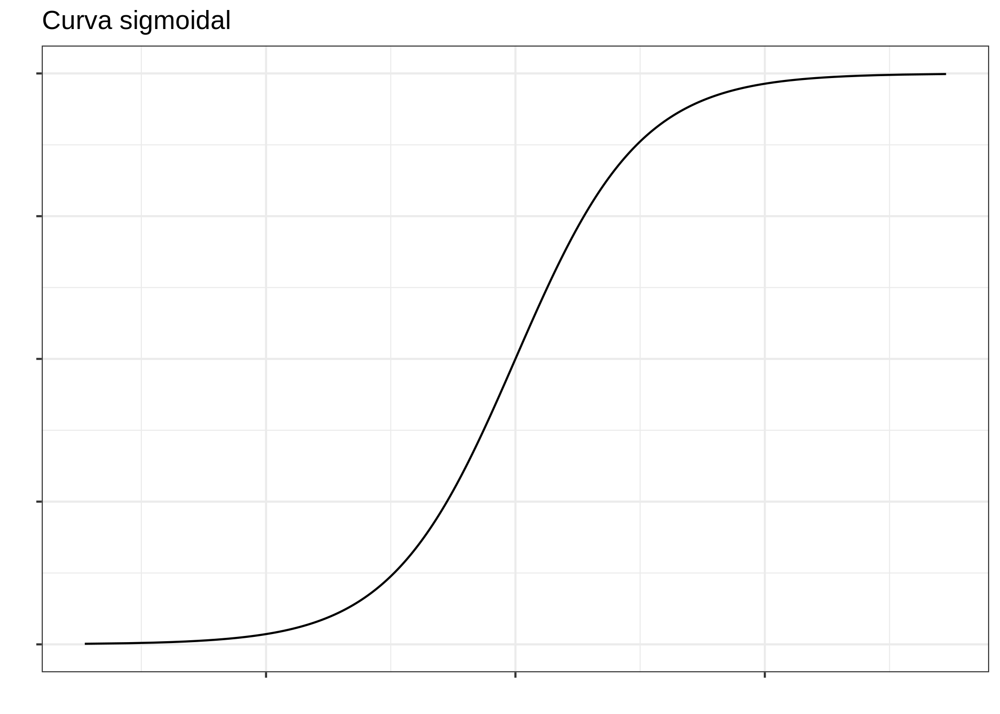
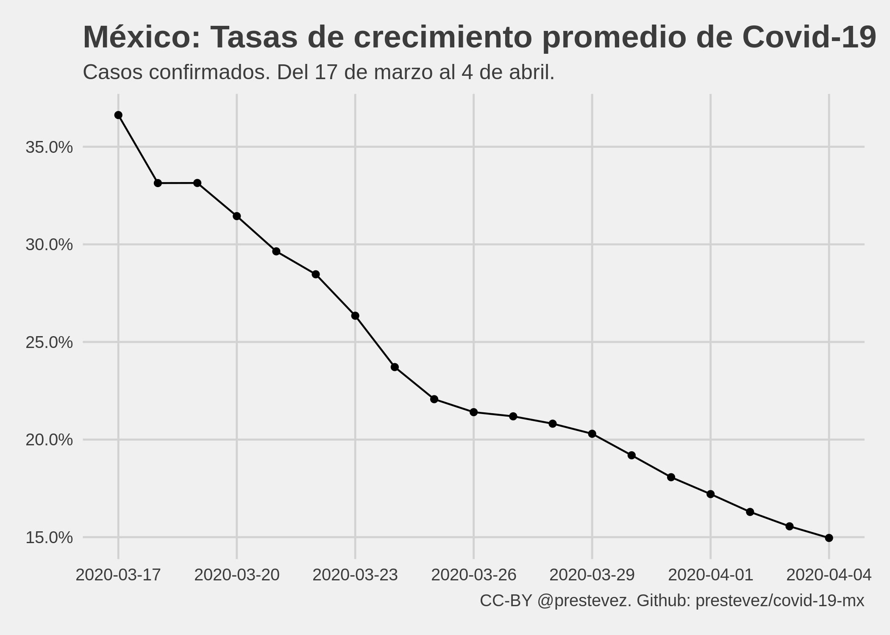
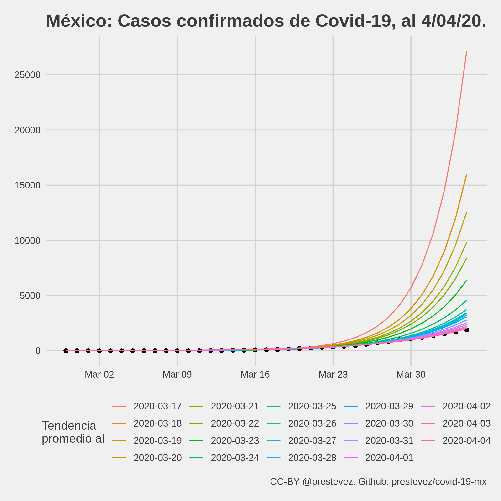

Desde hace más o menos 20 días he estado dando seguimiento a los datos de la [pandemia de covid-19](https://es.wikipedia.org/wiki/COVID-19) en México, [publicando en twitter](https://twitter.com/prestevez/status/1239898438160068616?s=20) gráficas con los números de casos confirmados por la [secretaría de salud](https://www.gob.mx/salud), así como una línea de tendencia del ritmo de crecimiento promedio observado a la fecha. Extrapolando la línea de tendencia, las gráficas también dan una vaga idea de cuántos casos confirmados de covid-19 se podrían esperar al día siguiente.

<blockquote class="twitter-tweet">
El total de casos de covid-19 en 🇲🇽 subió a 1688, debajo del límite inferior del rango esperado según la tendencia de ayer.  Si la tendencia a la fecha se mantiene, mañana se esperan entre 1892 y 2300 (95% IC) casos totales. <a href="https://t.co/yyKHifiHz5">pic.twitter.com/yyKHifiHz5</a>
&mdash; Patricio R. Estevez-Soto, PhD (@prestevez) <a href="https://twitter.com/prestevez/status/1246385176793530368?ref_src=twsrc%5Etfw">April 4, 2020</a></blockquote> 

Sin embargo, hoy decidí dejar de hacerlo. En esta entrada explico por qué.

## ¿Por qué empecé?

A principios de marzo Mexico (y el mundo) era otro. Había cerca de 5 casos de covid-19 confirmados en el país, y el [presidente continuaba minimizando la amenaza](https://www.eluniversal.com.mx/nacion/del-hay-que-abrazarse-no-pasa-nada-como-anillo-al-dedo-las-frases-de-amlo-sobre-el-covid-19), asegurando México estaba perfectamente preparado para la epidemia.

Aún cuando la Organización Mundial de la Salud [clasificó al covid-19 como pandemia el 11 de marzo](https://www.bbc.com/mundo/noticias-internacional-51842708), López Obrador continuó con sus giras y mítines, [haciendo caso omiso a las recomendaciones públicas de minimizar el contacto físico](https://www.bbc.com/mundo/noticias-america-latina-51921323).

Tras seguir con detenimiento la evolución de la pandemia en otros países, y ver lo rápido que se podían [colapsar los sistemas de salud de países muy bien preparados](https://www.theguardian.com/world/2020/mar/09/italian-hospitals-short-beds-coronavirus-death-toll-jumps), me preocupó mucho el daño que el covid-19 podría causar en México. En mi opinión había dos problemas. Por un lado, no se consideraba que nuestra capacidad hospitalaria es mucho más limitada que la de otros países, y no se estaba considerando lo rápido que la epidemia podría salirse de control dado el [ritmo de crecimiento exponencial que presentan los contagios al inicio de la epidemia.](https://bit.ly/2x5vdfQ).

### Capacidad hospitalaria

México es el país con el menor número de camas de hospital per cápita de la OECD. En otros contextos diríamos que no es una comparación justa, pues la mayoría de los países de la OECD son mucho más ricos que México. Pero en el caso de la pandemia, la comparación es importante si se considera que países ricos como Italia y España---que tienen el más o menos el doble de camas por habitante que México---se vieron rápidamente superados por el crecimiento de la epidemia.

<blockquote class="twitter-tweet">
Esta gráfica debería de preocuparnos mucho. El número de camas hospitalarias per cápita no es un indicador perfecto, pero permite ver más o menos cual es la capacidad del sistema de salud mexicano. Somos el país con la menor capacidad de la OECD. <a href="https://t.co/WXk9zrtzBh">pic.twitter.com/WXk9zrtzBh</a>
&mdash; Patricio R. Estevez-Soto, PhD (@prestevez) <a href="https://twitter.com/prestevez/status/1238125579301421059?ref_src=twsrc%5Etfw">March 12, 2020</a></blockquote> 

Dado que nuestro sistema de salud tiene menos capacidad, yo era de la opinión de que México debía actuar cuanto antes. Sin embargo, como a principios de marzo teníamos muy pocos casos confirmados de covid-19, muchos en México opinaban que era muy pronto para actuar (pues ello impondría costos excesivos). El problema es que esa visión no consideraba la velocidad exponencial de los contagios.

### Entender el crecimiento exponencial

> La mayor deficiencia de la raza humana es nuestra incapacidad para comprender la función exponencial.
>
> --[Albert Bartlett](https://en.wikipedia.org/wiki/Albert_Allen_Bartlett)

Si bien las epidemias tienden a seguir una curva sigmoidal, al inicio de las mismas (especialmente una de un patógeno altamente contagioso, como el [SARS-CoV-2](https://es.wikipedia.org/wiki/SARS-CoV-2)), el crecimiento de la curva se [aproxima al de una función exponencial](https://www.sciencedirect.com/science/article/pii/S2468042719300491).

*Ejemplo hipotético de una curva sigmoidal.*

La función exponencial es difícil de comprender para nuestros cerebros, pues estos están acostumbrados a percibir el mundo de forma lineal. Esto significa que cuando una amenaza crece de forma exponencial, [todo parece que está bien hasta que nos explota en la cara](https://www.washingtonpost.com/opinions/2020/03/10/coronavirus-what-matters-isnt-what-you-can-see-what-you-cant/), aún y cuando el patrón era bastante predecible.

<blockquote class="twitter-tweet">
Los crecimientos lineales son aditivos, es decir, por cada período de tiempo los casos aumentan de forma constante. Los crecimientos exponenciales son distintos pues el ritmo de crecimiento no es constante, sino parece que &quot;de repente&quot; el número explota. <a href="https://t.co/Exbr18HpZU">pic.twitter.com/Exbr18HpZU</a>
&mdash; Patricio R. Estevez-Soto, PhD (@prestevez) <a href="https://twitter.com/prestevez/status/1238460508300337152?ref_src=twsrc%5Etfw">March 13, 2020</a></blockquote> 

<blockquote class="twitter-tweet" data-conversation="none">
Como muestra esta gráfica de una simulación de este proceso exponencial, todo parece que está bien, hasta que de pronto estalla y el sistema se colapsa. <a href="https://t.co/HdPDJou9T0">pic.twitter.com/HdPDJou9T0</a>
&mdash; Patricio R. Estevez-Soto, PhD (@prestevez) <a href="https://twitter.com/prestevez/status/1238468548361621505?ref_src=twsrc%5Etfw">March 13, 2020</a></blockquote> 

Por tanto, para poder observar el crecimiento de la epidemia, comencé a dar seguimiento al número de casos confirmados en México.

## ¿En qué consistía el seguimiento?

Parte del ejercicio de seguimiento nació de la frustración. Uno esperaría que los datos de un problema tan importante para la vida nacional se publicaran en formato abierto y accesible, por ejemplo en el portal de [datos abiertos](https://datos.gob.mx/) del gobierno federal.

La primer tarea, entonces, fue recopilar el conteo de casos confirmados (y posteriormente muertes) en un archivo csv. Una vez con los datos en un formato accesible, comencé a modelar una simple línea de tendencia asumiendo un modelo exponencial para visualizar el ritmo promedio de crecimiento de los casos confirmados, y hacer una extrapolación sencilla al día siguente..

Las gráficas y modelos las generé utilizando R, y todo el código y datos han estado disponibles en un [repositorio en Github](https://github.com/prestevez/covid-19-mx). El proceso es más o menos automatizado. Cada día se agrega (manualmente) una línea al archivo csv con la fecha y los acumulados de casos confirmados y muertes dados a conocer en la conferencia de prensa vespertina del gobierno federal mexicano. Luego corro el código para actualizar las gráficas, calcular un modelo de tendencia nuevo, y generar una predicción para el día de mañana.

El modelo utilizado es extremadamente sencillo. No incorpora [supuestos epidemiológicos](https://twitter.com/danitte/status/1240330754460008448?s=20), por lo que no es un modelo "correcto".

> En esencia, todos los modelos están equivocados, pero algunos son útiles.
>
> --[George Box](https://es.wikipedia.org/wiki/George_Edward_Pelham_Box)

Modelar correctamente una epidemia es un asunto complejo. En el modelo más simple, conocido como [SIR](https://es.wikipedia.org/wiki/Modelo_SIR), se modelan tres poblaciones en el tiempo: _Susceptibles_,  _Infectados_, y _Recuperados_, utilizando una serie de ecuaciones diferenciales.

Este tipo de modelos se le llama modelo mecanicista, pues trata de capturar el mecanismo subyacente que alimenta la epidemia, dado los parámetros específicos de la población y el patógeno en cuestión.

El modelo que yo utilicé es lo opuesto. Ignora cualquier supuesto de las características de la enfermedad y la población, y asume que el crecimiento promedio observado a la fecha se va a mantener en el futuro. Formalmente, el modelo para el acumulado de casos confirmados, $y_t$, para un día $t$ es:

$$
E[y_t | t] = e^{\beta_0 + \beta_1 \times t}
$$

Es absurdo asumir que un modelo tan ingenuo como este podría capturar la dinámica real de la epidemia. Por un lado, el modelo predice el crecimiento infinito de la epidemia, y por otro los intervalos de confianza están equivocados dada la fuerte correlación serial entre observaciones, entre otros motivos.

Sin embargo, a pesar de ser un modelo equivocado, decidí usarlo pues era útil para mis---muy modestas---intenciones. Como he dicho antes, mi intención era comunicar que la tasa de crecimiento en la primera fase de la epidemia de covid-19 en México se mueve a un ritmo exponencial para crear conciencia sobre la velocidad de la amenaza.

Siempre fui claro sobre las [limitaciones del modelo](https://twitter.com/prestevez/status/1244551339960668161?s=20), y enfaticé que las predicciones solo eran válidas (aún y con gran incertidumbre) para el día siguiente, pese a que muchas personas me pidieron que extrapolara la epidemia a meses al futuro. También siempre tuve claro que el modelo dejaría de ser útil, tanto por cambios en la dinámica de la epidemia o por nuestra capacidad para medirla, y sabía que ese día dejaría de darle seguimiento.

## ¿Qué tan buenos eran los modelos?

Una de las razones que me orillaron a dejar de actualizar estos modelos es que estos han perdido su utilidad para predecir con precisión como se desarrollará la epidemia en el futuro. La gráfica a continuación presenta cómo ha evolucionado la tasa de crecimiento promedio. Como se observa, los datos observados hasta el 17 de marzo sugerían una tasa de crecimiento promedio de 37% por día. Sin embargo, cada modelo posterior sugirió una tasa de crecimiento igual o inferior a la del día anterior, llegando a un mínimo de 15% por día el 4 de abril.

*Tasas de crecimiento promedio estimadas por el modelo exponencial.*

Si bien algunas de las predicciones hechas para el día siguiente estuvieron dentro del intervalo de confianza al 95% estimado utilizando un remuestreo jackknife, las predicciones de largo aliento con estos modelos hubieran estado enormemente equivocadas. Si hubiese hecho extrapolaciones de más largo plazo[^1], como muchos me pidieron en twitter, los modelos hubieran predicho que para principio de abril tendríamos decenas de miles de casos.

[^1]: Los primeros días que presenté estos modelos en twitter pesentaba extrapolaciones de tres días, sin embargo al reconocer el gran potencial de errar en la predicción [reduje las extrapolaciones a solo un día](https://twitter.com/prestevez/status/1240452086380331009?s=20).

*Predicciones al 4 de abril utilizando las tasa de crecimiento identificadas por los modelos entre el 17 de marzo y el 4 de abril.*

Por ejemplo, si la tendencia observada el 17 de marzo de 37% por día se hubiese mantenido a la fecha, el 4 de abril hubiéramos alcanzado alrededor de 27 mil casos confirmados de covid-19 en México. En realidad, el 4 de abril se han confirmado solamente 1,890 casos.

Varios me han preguntado qué significa que la tasa de crecimiento promedio haya disminuido constantemente desde mediados de marzo. Se han propuesto dos explicaciones. La primera es que las medidas de distanciamiento social implementadas por la sociedad civil, gobiernos locales y (posteriormente) el gobierno federal han contribuido a frenar la epidemia en el país. La segunda, por otro lado, es que dado el pequeñísimo número de pruebas de covid-19 que se realizan en el país, no estamos detectando la verdadera dinámica de la epidemia.

No creo que haya pasado suficiente tiempo para que las medidas de distanciamiento social hayan tenido un efecto considerable en la dinámica de la epidemia, aunque esa es una observación de alguien que no es un experto en la materia.

Por otro lado, me parece más plausible que la desaceleración en el crecimiento de los casos confirmados de covid-19 en el país tenga que ver con la cantidad de pruebas que realizamos. El número de casos de covid-19 que se detectan está fuertemente determinado por el [régimen y la cantidad de pruebas](https://fivethirtyeight.com/features/coronavirus-case-counts-are-meaningless/) que se realizan. En la mayoría de los países la cantidad de casos confirmados es solo una muestra del total de casos de la epidemia. Dada la cantidad de pruebas por persona realizadas en México, existen razones para suponer que la ["cifra negra" del covid-19 en el país](https://www.washingtonpost.com/es/tablet/2020/04/01/por-que-mexico-tiene-tan-pocos-casos-de-coronavirus-en-comparacion-con-estados-unidos/) es particularmente extensa.

<blockquote class="twitter-tweet">
Desde el 26 de marzo se han reportado 135 casos x día en promedio.  Parece que estamos llegando a un límite de nuestra capacidad (o voluntad) de detección de casos de covid-19, por lo que las predicciones de modelos exponenciales van a estar equivocadas.
&mdash; Patricio R. Estevez-Soto, PhD (@prestevez) <a href="https://twitter.com/prestevez/status/1246385183659565058?ref_src=twsrc%5Etfw">April 4, 2020</a></blockquote> 

El hecho de que los casos nuevos reportados por día desde el 26 de marzo parecen haberse estabilizado al rededor de 135 casos por día sugeriría que el crecimiento ha dejado de ser exponencial y ahora se comporta de manera lineal. Ello sería consistente con las [simulaciones realizadas](http://puntodecimal.mx/ciencia/dejemos-de-utilizar-el-numero-de-casos-confirmados-de-coronavirus) por mi colega, [Rafael Prieto Curiel](https://twitter.com/rafaelprietoc), que sugieren un crecimiento lineal de los casos confirmados cuando se alcance el máximo de pruebas que podemos realizar por día dada nuestra capacidad limitada.

Sin embargo, también hay otras explicaciones que podrían considerarse, entre ellas que el ritmo de crecimiento observado a mediados de marzo no correspondía al ritmo de contagio local en el país, sino a grupos de casos de personas que se contagiaron en el extranjero y fueron detectados "de golpe" al regresar al país.

Independientemente de la razón, el punto es que los modelos que estaba utilizando ya no son útiles para darle seguimiento a los casos confirmados.

## ¿Qué mas cambió?

Además del fin de la utilidad de los modelos, he notado otros cambios importantes que me motivaron a dejar de lado este ejercicio.

Por un lado el gobierno de México formalmente declaró una emergencia sanitaria y ha comenzado a imponer medidas más estrictas para reducir el impacto de la epidemia. Por otro lado, veo entre mis conocidos de twitter y otras redes sociales que la opinión pública hacia la epidemia ha cambiado.

Si bien no creo que estos modelos hayan sido determinantes para cambiar la opinión pública, creo que pudieron haber contribuido de manera positiva a generar conciencia de la amenaza. Mis tuits sobre los modelos y las predicciones de covid-19 en México fueron vistos más de 2.5 millones de veces, según los reportes de *analytics* de twitter. Muchas personas me escribieron para comentarme que les parecían muy útiles y que les ayudaron a dimensionar el fenómeno al que se enfrenta el país.

Otros cambios positivos que noté es que de no haber casi nada de datos y análisis del covid-19 en México a principios de Marzo, han surgido excelentes proyectos de seguimiento de la epidemia en el país. Entre los que he notado, recomiendo:

- [Covidatos.mx](http://covidatos.mx/)
- [Mexicovid19](https://mexicovid19.github.io/Mexico/)
- [covid19enmexico.com](https://covid19enmexico.com/)
- [Twitter de Sebastián Garrido](https://twitter.com/segasi)

## ¿Qué sigue?

Por estas razones he decidido dejar de dar seguimiento a los casos confirmados de covid-19 en el país. Le agradezco a todas las personas que me hicieron comentarios para mejorar los modelos.

Si bien no daré mas seguimiento a los casos confirmados de covid-19 en el país, en los próximos meses estaré realizando una investigación sobre los efectos de la epidemia en la incidencia delictiva en la Ciudad de México. Puedes saber más de ese [proyecto en OSF](https://osf.io/3gf67/) o en mi cuenta de [twitter](https://twitter.com/prestevez).
