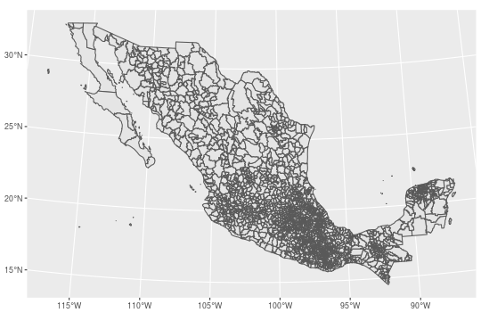
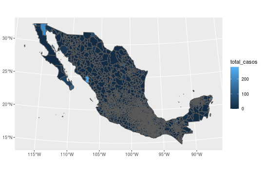
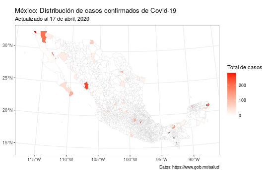
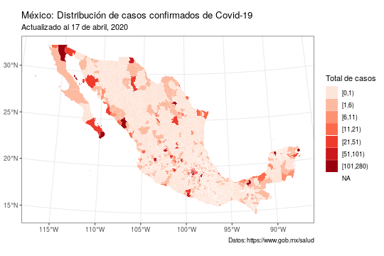
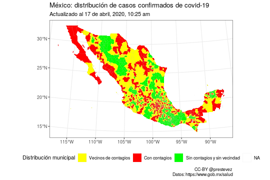

Hace unos días publiqué un par de mapas en twitter sobre la distribución geográfica de los casos confirmados de la enfermedad covid-19 en México. Me preguntaron en qué software hice los mapas y me pareció una buena oportunidad para escribir un breve tutorial sobre como hacer mapas en [R](https://www.r-project.org/).

<blockquote class="twitter-tweet" data-lang="es"><p lang="es" dir="ltr">Nuevos mapas sobre covid-19 en México. Pueden descargar png y pdf en alta resolución en:<a href="https://t.co/tHEBkwOxPZ">https://t.co/tHEBkwOxPZ</a> <a href="https://t.co/LV28r9iGm8">pic.twitter.com/LV28r9iGm8</a></p>&mdash; Patricio R. Estevez-Soto, PhD (@prestevez) <a href="https://twitter.com/prestevez/status/1251180205626077184?ref_src=twsrc%5Etfw">17 de abril de 2020</a></blockquote> <script async src="https://platform.twitter.com/widgets.js" charset="utf-8"></script>

**Este tutorial asume que sabes usar R. No necesitas ser experto, pero un conocimiento básico de R es necesario.** También recomiendo saber usar los paquetes de `tidyverse`, especialmente `ggplot2` y `dplyr`.

Si aún no usas R, puedes aprovechar la cuarentena forzada por covid-19 para [aprender](https://github.com/jmtoral/Introduccion_a_R).

## Por qué usar R cuando existe QGIS o ArcGIS

Normalmente, la visualización y análisis de mapas (y otra información geográfica) se hace usando programas llamados [sistemas de información geográfica](https://es.wikipedia.org/wiki/Sistema_de_informaci%C3%B3n_geogr%C3%A1fica) (conocidos como GIS en inglés). Entre los más conocidos está [ArcGIS](https://www.arcgis.com/index.html) (probablemente el *gold standard* de GIS, aunque es software de paga). En el mundo de software libre una alternativa muy completa es [QGIS](https://qgis.org/en/site/).

R es principalmente un programa de análisis estadístico; no es un GIS. Los GIS son programas muy complejos. Quienes trabajan con datos geográficos cotidianamente probablemente sean más productivos usando un GIS.

Sin embargo, también son programas un tanto pesados y que demandan recursos importantes de tu computadora. Por tanto, si quieres hacer un mapa relativamente sencillo, a veces puede ser más fácil hacerlo en R.

Una segunda ventaja de usar R es que, al ser un lenguaje de programación, es más fácil trabajar de forma sistemática y generar mapas y análisis que sean reproducibles---una consideración importante especialmente en estudios científicos. En otros GIS también es posible usar *scripts* de programación, pero la principal forma de interactuar con estos programas es a través de la interfaz gráfica, mientras que en R la interacción es a través de código.

## R + sf + tidyverse

Existen varios [paquetes para trabajar con datos espaciales en R](https://cran.r-project.org/web/views/Spatial.html). Yo trabajo principalmente con un paquete nuevo llamado [`sf`](https://r-spatial.github.io/sf/) (por [*simple features*](https://www.ogc.org/standards/sfa) un estándar para representar información geográfica).

Una gran ventaja de `sf` es que los objetos de esta clase son compatibles con los paquetes del universo `tidyverse`. La colección de paquetes del [`tidyverse`](https://www.tidyverse.org/) ofrece muchas ventajas para manipular, analizar y visualizar datos, en especial los verbos de `dplyr` y el paquete para graficar `ggplot2`.

Si ya trabajas con `tidyverse`, hacer mapas con `sf` te va a parecer extremadamente sencillo e intuitivo.

### Instalación y carga de paquetes

Si no tienes instalado `tidyverse` o `sf`, puedes hacerlo con el siguiente comando:


```r
install.packages("tidyverse")
install.packages("sf")
```

Ojo, instalar `tidyverse` es sencillo, pero `sf` puede ser más complicado. Esto es porque `sf` necesita interactuar con librerías especiales para el manejo de datos espaciales. La instalación de estas librerías dependerá del tipo de sistema que utilices (Windows, macOS, Linux). Visita la página de [`sf`](https://r-spatial.github.io/sf/) para más información.

Una vez que los paquetes están instalados, procedemos a cargarlos en nuestra sesión en R:


```r
library(tidyverse)
library(sf)
```

### Un mapa básico

Para generar cualquier mapa lo primero es cargar un objeto espacial. En este caso utilizo un [*shapefile*](https://es.wikipedia.org/wiki/Shapefile) de los municipios de México que me paso un amigo en [twitter](https://twitter.com/moaimx/status/1250817221372383233?s=20). En este caso utilicé este archivo pues el marco geoestadístico oficial del INEGI pesa más de 3 GB y se tardaría demasiado en descargar.

Para cargarlo en la memoria corremos los siguientes comandos. El primero crea una carpeta llamada `datos_covid` en nuestra carpeta de trabajo (`?getwd`), el segundo descarga de un [repositorio en GitHub](https://github.com/prestevez/covid-19-mx-map) un archivo comprimido que contiene el shapefile que vamos a utilizar. El tercer comando extrae el archivo en la carpeta `datos_covd`, y finalmente el cuarto carga el shapefile en R.


```r
# Crear carpeta donde descargar el archivo
dir.create("datos_covid/")
```

```
Warning in dir.create("datos_covid/"): 'datos_covid' already exists
```

```r
# Descarga el archivo zip de github
download.file(url = "https://github.com/prestevez/covid-19-mx-map/raw/master/datos_covid/01_32_mun.zip",
              destfile = "datos_covid/01_32_mun.zip")

# Extrae el archivo zip en la carpeta datos_covid
unzip("datos_covid/01_32_mun.zip",
      exdir = "datos_covid/")

# Carga el archivo shapefile a R
mex_map <- st_read("datos_covid/01_32_mun.shp")
```

```
Reading layer `01_32_mun' from data source `/home/rstudio/local/datos_covid/01_32_mun.shp' using driver `ESRI Shapefile'
Simple feature collection with 2463 features and 4 fields
geometry type:  MULTIPOLYGON
dimension:      XY
bbox:           xmin: 911292 ymin: 319149.1 xmax: 4082997 ymax: 2349615
proj4string:    +proj=lcc +lat_1=17.5 +lat_2=29.5 +lat_0=12 +lon_0=-102 +x_0=2500000 +y_0=0 +ellps=GRS80 +units=m +no_defs
```

Una vez cargado el archivo, crear un mapa es tan sencillo como generar una gráfica con `ggplot2`:


```r
mex_map %>%
  ggplot() + # Crea un objeto ggplot a partir del objeto mex_map
  geom_sf() # agrega una capa con el mapa
```



A diferencia de objetos espaciales generados por otros paquetes en R, generar el mapa no requiere especificar valores x o y, ajustar coordenadas ni nada por el estilo. A partir de la versión 3.0.0 de `ggplot2`, se puede graficar mapas de objetos `sf` nativamente utilizando la función `geom_sf()`.

## Mapa de coropletas

Ahora que sabemos generar un mapa básico en R, vamos a crear un [mapa temático o coroplético](https://es.wikipedia.org/wiki/Mapa_coropl%C3%A9tico) con la distribución de casos confirmados de covid-19 en los municipios de México.

Para comenzar, revisemos la estructura básica del objeto `mex_map`:


```r
mex_map
```

```
Simple feature collection with 2463 features and 4 fields
geometry type:  MULTIPOLYGON
dimension:      XY
bbox:           xmin: 911292 ymin: 319149.1 xmax: 4082997 ymax: 2349615
proj4string:    +proj=lcc +lat_1=17.5 +lat_2=29.5 +lat_0=12 +lon_0=-102 +x_0=2500000 +y_0=0 +ellps=GRS80 +units=m +no_defs
First 10 features:
   CVEGEO CVE_ENT CVE_MUN              NOMGEO                       geometry
1   01001      01     001      Aguascalientes MULTIPOLYGON (((2489073 111...
2   01002      01     002            Asientos MULTIPOLYGON (((2494680 114...
3   01003      01     003            Calvillo MULTIPOLYGON (((2429607 112...
4   01004      01     004               Cosío MULTIPOLYGON (((2470518 115...
5   01005      01     005         Jesús María MULTIPOLYGON (((2465527 111...
6   01006      01     006 Pabellón de Arteaga MULTIPOLYGON (((2473997 112...
7   01007      01     007     Rincón de Romos MULTIPOLYGON (((2476760 115...
8   01008      01     008  San José de Gracia MULTIPOLYGON (((2463680 112...
9   01009      01     009            Tepezalá MULTIPOLYGON (((2481572 114...
10  01010      01     010            El Llano MULTIPOLYGON (((2496975 111...
```

Una de las gran ventajas de los objetos `sf` es que guardan la información geográfica como un tabla (específicamente como un `data.frame`). La primera parte del output en la consola es la información geográfica del objeto: el tipo de geometría (punto, línea, polígono o multipolígono), tamaño, y proyección cartográfica. La segunda son las primeras 10 líneas del `data.frame` en el que cada línea es un municipio, la columna `geometry` contiene la información geográfica de cada polígono municipal, y el resto de columnas contiene información de cada municipio---en este caso la claves geoestadísticas y el nombre.

Esto significa que para poder crear el mapa coroplético sería tan sencillo como tener una columna con el número de casos por municipios.

Para esto cargamos un archivo `csv` con el número de casos confirmados por municipios que publica la secretaría de salud de México. (Para asegurar que este código siga vigente voy a utilizar la tabla de casos confirmados del 16 de abril de 2020 que tengo en GitHub).


```r
datos_mun <- read_csv("https://raw.githubusercontent.com/prestevez/covid-19-mx-map/master/datos_covid/Casos_Diarios_Estado_Nacional_Confirmados.csv")
```

```
Parsed with column specification:
cols(
  .default = col_double(),
  cve_ent = col_character(),
  nombre = col_character()
)
```

```
See spec(...) for full column specifications.
```

```r
datos_mun
```

```
# A tibble: 2,457 x 54
   cve_ent poblacion nombre `26-02-2020` `27-02-2020` `28-02-2020` `29-02-2020` `01-03-2020` `02-03-2020`
   <chr>       <dbl> <chr>         <dbl>        <dbl>        <dbl>        <dbl>        <dbl>        <dbl>
 1 01001      961977 Aguas…            0            0            0            0            0            0
 2 01002       50864 Asien…            0            0            0            0            0            0
 3 01003       60760 Calvi…            0            0            0            0            0            0
 4 01004       16918 Cosio             0            0            0            0            0            0
 5 01005      130184 Jesus…            0            0            0            0            0            0
 6 01006       50032 Pabel…            0            0            0            0            0            0
 7 01007       57981 Rinco…            0            0            0            0            0            0
 8 01008        9661 San J…            0            0            0            0            0            0
 9 01009       22743 Tepez…            0            0            0            0            0            0
10 01010       21947 El Ll…            0            0            0            0            0            0
# … with 2,447 more rows, and 45 more variables: `03-03-2020` <dbl>, `04-03-2020` <dbl>, `05-03-2020` <dbl>,
#   `06-03-2020` <dbl>, `07-03-2020` <dbl>, `08-03-2020` <dbl>, `09-03-2020` <dbl>, `10-03-2020` <dbl>,
#   `11-03-2020` <dbl>, `12-03-2020` <dbl>, `13-03-2020` <dbl>, `14-03-2020` <dbl>, `15-03-2020` <dbl>,
#   `16-03-2020` <dbl>, `17-03-2020` <dbl>, `18-03-2020` <dbl>, `19-03-2020` <dbl>, `20-03-2020` <dbl>,
#   `21-03-2020` <dbl>, `22-03-2020` <dbl>, `23-03-2020` <dbl>, `24-03-2020` <dbl>, `25-03-2020` <dbl>,
#   `26-03-2020` <dbl>, `27-03-2020` <dbl>, `28-03-2020` <dbl>, `29-03-2020` <dbl>, `30-03-2020` <dbl>,
#   `31-03-2020` <dbl>, `01-04-2020` <dbl>, `02-04-2020` <dbl>, `03-04-2020` <dbl>, `04-04-2020` <dbl>,
#   `05-04-2020` <dbl>, `06-04-2020` <dbl>, `07-04-2020` <dbl>, `08-04-2020` <dbl>, `09-04-2020` <dbl>,
#   `10-04-2020` <dbl>, `11-04-2020` <dbl>, `12-04-2020` <dbl>, `13-04-2020` <dbl>, `14-04-2020` <dbl>,
#   `15-04-2020` <dbl>, `16-04-2020` <dbl>
```

La tabla con casos confirmados de covid-19 por municipio contiene una línea por municipio, columnas con la clave geoestadística, población, el nombre y una columna por día de observación. Como queremos una columna con el número de casos por municipio, necesitamos agregar las columnas de cada día:


```r
casos_municipio <- datos_mun %>%
  # pasamos del formato ancho al largo
  pivot_longer(-c(cve_ent, poblacion, nombre),
               names_to = "día",
               values_to = "casos") %>%
  # agrupamos por municpio
  group_by(cve_ent, poblacion, nombre) %>%
  # sumamos los casos
  summarise(total_casos = sum(casos))

casos_municipio
```

```
# A tibble: 2,457 x 4
# Groups:   cve_ent, poblacion [2,457]
   cve_ent poblacion nombre              total_casos
   <chr>       <dbl> <chr>                     <dbl>
 1 01001      961977 Aguascalientes               60
 2 01002       50864 Asientos                      1
 3 01003       60760 Calvillo                      0
 4 01004       16918 Cosio                         0
 5 01005      130184 Jesus Maria                   1
 6 01006       50032 Pabellon de Arteaga           5
 7 01007       57981 Rincon de Romos               2
 8 01008        9661 San Jose de Gracia            0
 9 01009       22743 Tepezala                      1
10 01010       21947 El Llano                      1
# … with 2,447 more rows
```

Ahora hay que unir la tabla con el total de casos por municipio a la tabla con la información geográfica. Para unir dos tablas (ej: A y B) necesitamos tener una columna que nos indique qué observación en la tabla A corresponde a la observación de la tabla B. En este caso ambas tablas tienen una columna con la clave geostadística única para cada municipio. Unimos las tablas con este código:


```r
mex_map_covid <- mex_map %>%
  # unir tablas
  left_join(casos_municipio,
            # indicar explícitamente las columnas índice,
            # necesario cuando no tienen el mismo nombre
            by = c("CVEGEO" = "cve_ent"))
```

```
Warning: Column `CVEGEO`/`cve_ent` joining factor and character vector, coercing into character vector
```

```r
mex_map_covid
```

```
Simple feature collection with 2463 features and 7 fields
geometry type:  MULTIPOLYGON
dimension:      XY
bbox:           xmin: 911292 ymin: 319149.1 xmax: 4082997 ymax: 2349615
proj4string:    +proj=lcc +lat_1=17.5 +lat_2=29.5 +lat_0=12 +lon_0=-102 +x_0=2500000 +y_0=0 +ellps=GRS80 +units=m +no_defs
First 10 features:
   CVEGEO CVE_ENT CVE_MUN              NOMGEO poblacion              nombre total_casos
1   01001      01     001      Aguascalientes    961977      Aguascalientes          60
2   01002      01     002            Asientos     50864            Asientos           1
3   01003      01     003            Calvillo     60760            Calvillo           0
4   01004      01     004               Cosío     16918               Cosio           0
5   01005      01     005         Jesús María    130184         Jesus Maria           1
6   01006      01     006 Pabellón de Arteaga     50032 Pabellon de Arteaga           5
7   01007      01     007     Rincón de Romos     57981     Rincon de Romos           2
8   01008      01     008  San José de Gracia      9661  San Jose de Gracia           0
9   01009      01     009            Tepezalá     22743            Tepezala           1
10  01010      01     010            El Llano     21947            El Llano           1
                         geometry
1  MULTIPOLYGON (((2489073 111...
2  MULTIPOLYGON (((2494680 114...
3  MULTIPOLYGON (((2429607 112...
4  MULTIPOLYGON (((2470518 115...
5  MULTIPOLYGON (((2465527 111...
6  MULTIPOLYGON (((2473997 112...
7  MULTIPOLYGON (((2476760 115...
8  MULTIPOLYGON (((2463680 112...
9  MULTIPOLYGON (((2481572 114...
10 MULTIPOLYGON (((2496975 111...
```

Una vez unidas las tablas, podemos hacer el mapa de coropletas con este código:


```r
mex_map_covid %>%
  # usamos el aesthetic fill para indicar la columna de casos
  ggplot(aes(fill = total_casos)) +
  geom_sf()
```




El mapa funciona, pero no es particularmente atractivo. En particular las líneas de los polígonos municipiales están muy gruesas y el color del mapa no es útil para conocer la distribución de casos. Como este es un objeto de `ggplot2` podemos cambiar toda la estética del mapa con mucha facilidad.


```r
mex_map_covid %>%
  # usamos el aesthetic fill para indicar la columna de casos
  ggplot(aes(fill = total_casos)) +
  # cambia el color y el grosor de las líneas
  geom_sf(colour = "grey75", size = 0.07) +
  # agrega títulos
  labs(title = "México: Distribución de casos confirmados de Covid-19",
       subtitle = "Actualizado al 17 de abril, 2020",
       caption = "Datos: https://www.gob.mx/salud") +
  # cambia el color de relleno y el título de la leyenda
  scale_fill_gradient("Total de casos", high = "red", low = "white") +
  # retirar el fondo gris
  theme_bw()
```




Algo evidente es que la gran mayoría de los municipios en México no tiene casos de covid-19. Por tanto, al utilizar una escala continua el mapa no es muy informativo. Para mejorar la visualización podemos cambiar la variable de casos a categorías discretas. Podemos usar la función `cut` para generar automáticamente los cortes.


```r
# vector con los puntos de corte
brks <- c(0,1,6,11,21,51,101,
            max(mex_map_covid$total_casos, na.rm = TRUE))

mex_map_covid %>%
  # usamos dplyr para generar una nueva columna
  mutate(casos_cut = cut(total_casos, breaks = brks, right = FALSE)) %>%
  # usamos el aesthetic fill para indicar la columna de casos_cut
  ggplot(aes(fill = casos_cut)) +
  # cambia el color y el grosor de las líneas
  geom_sf(colour = "white", size = 0.07) +
  # agrega títulos
  labs(title = "México: Distribución de casos confirmados de Covid-19",
       subtitle = "Actualizado al 17 de abril, 2020",
       caption = "Datos: https://www.gob.mx/salud") +
  # cambia el color de relleno, nota que es una función distinta
  scale_fill_brewer("Total de casos", palette = "Reds") +
  # retirar el fondo gris
  theme_bw()
```




Noten que el mapa arrojó que algunos municipios no tenían un valor válido (`NA`). Esto se debe a que la base de datos de la secretaría de salud no contiene a todos los municipios del país.

El shapefile tiene 2463 municipios, mientras que la tabla de casos tiene 2457 municipios. Por lo que a la hora de unir las tablas a los municipios sin conteo correspondiente se les asignó un valor `NA`.

## Procesamiento geográfico, encontrando vecinos

El 16 de abril la secretaría de salud presentó un mapa de "riesgo" de la transmisión de covid-19 en el país. Este mapa pintaba de rojo a los municipios con contagios, de amarillo a los municipios vecinos de municipios con contagios, y de verde a los municipios sin contagios y sin vecinos con contagios.

<blockquote class="twitter-tweet" data-lang="es"><p lang="es" dir="ltr">Según lo que presentó <a href="https://twitter.com/HLGatell?ref_src=twsrc%5Etfw">@HLGatell</a>, en los 979 municipios en verde se podría &quot;regresar a la normalidad&quot; el 17 de mayo.<br><br>Para poner esto en perspectiva, en estos municipios viven más o menos 11.2 millones de personas, menos del 8.74% de la población. <a href="https://t.co/s7jbYfPVWT">pic.twitter.com/s7jbYfPVWT</a></p>&mdash; Patricio R. Estevez-Soto, PhD (@prestevez) <a href="https://twitter.com/prestevez/status/1250840591606431745?ref_src=twsrc%5Etfw">16 de abril de 2020</a></blockquote> <script async src="https://platform.twitter.com/widgets.js" charset="utf-8"></script>

Para elaborar este mapa necesitamos más información de la que tenemos. En específico, necesitamos determinar qué municipios son vecinos de los municipios con contagios. Este tipo de operaciones se les conoce como operaciones de procesamiento geográfico. El paquete `sf` contiene funciones que nos permite realizar este tipo de operaciones sin mucho problema.

En este caso, el procedimiento que podríamos hacer es:

1. Identificar a los municipios con contagios.
2. Identificar a los vecinos de municipios con contagios.
3. Por eliminación, identificar a los municipios sin vecinos y sin contagios.

Realizamos los primeros dos pasos con este código.


```r
mex_map_covid %>%
  # seleccionamos a los municipios con por lo menos un caso
  filter(total_casos > 0) -> mex_map_covid_contagio

mex_map_covid %>%
  # Econtramos los vecinos
  st_intersects(mex_map_covid_contagio) -> vecinos_covid

vecinos_covid
```

```
Sparse geometry binary predicate list of length 2463, where the predicate was `intersects'
first 10 elements:
 1: 1, 2, 3, 7, 151
 2: 1, 2, 4, 6, 7
 3: 1, 3
 4: 5
 5: 1, 3, 4
 6: 2, 3, 4, 5, 6
 7: 4, 5, 6
 8: 3, 4, 5
 9: 2, 4, 5, 6
 10: 1, 2, 7, 151
```

El objeto `vecinos_covid` es una matriz de colindancia. Para cada municipio del país, nos dice qué municipios con contagio son vecinos. Los municipios sin contagios y sin vecinos con contagio tienen una observación de longitud zero, lo que nos ayuda a seleccionarlos.


```r
sin_vecinos_o_covid <- lengths(vecinos_covid) < 1
```

Finalmente, utilizamos esta información para crear una nueva columna para crear el mapa.


```r
 mex_map_covid <-
  mex_map_covid %>%
  # creamos una columna nueva llamada covid, en la que el 1 indica contagios
  mutate(covid = ifelse(total_casos > 0, 1, 0))

# Cambiamos a 2 en la columna covid los municipios sin vecinos o contagios
mex_map_covid[sin_vecinos_o_covid, ]$covid <- 2

# Cambiamos la columna covid de número a factor con categorías.
mex_map_covid %>%
  mutate(covid = factor(covid,
                           labels = c("Vecinos de contagios",
                                      "Con contagios",
                                      "Sin contagios y sin vecindad"))) -> mex_map_covid

mex_map_covid %>%
  ggplot(aes(fill = covid)) +
  geom_sf(colour = "grey75", size = 0.05) +
  scale_fill_manual("Distribución municipal",
                    values = c("yellow", "red", "green")) +
  labs(title = "México: distribución de casos confirmados de covid-19",
       subtitle = "Actualizado al 17 de abril, 2020, 10:25 am",
       caption = "CC-BY @prestevez \nDatos: https://www.gob.mx/salud") +
  theme_bw() +
  theme(legend.position = "bottom")
```




## Guardar mapas

Finalmente, si queremos podemos guardar los mapas generados usando la interfaz gráfica, o usando la función `ggsave`.


```r
mex_map_covid %>%
  ggplot(aes(fill = covid)) +
  geom_sf(colour = "grey75", size = 0.05) +
  scale_fill_manual("Distribución municipal",
                    values = c("yellow", "red", "green")) +
  labs(title = "México: distribución de casos confirmados de covid-19",
       subtitle = "Actualizado al 17 de abril, 2020",
       caption = "Datos: https://www.gob.mx/salud") +
  theme_bw() +
  theme(legend.position = "bottom") -> mapa_vecinos

# Guargdar en formato PNG
ggsave("casos_vecindad.png",
       mapa_vecinos,
       width = 7.5,
       height = 5)

# En formato PDF en tamaño carta
ggsave("casos_vecindad.pdf",
       mapa_vecinos,
       width = 11,
       height = 8.5,
       device = cairo_pdf)
```


En estas ligas puedes descargar las versiones en [PNG](https://github.com/prestevez/covid-19-mx-map/raw/master/casos_vecindad.png) y en [PDF](https://github.com/prestevez/covid-19-mx-map/raw/master/casos_vecindad.pdf).

Espero el tutorial haya sido útil para ti. Si tienes alguna duda o sugerencia, escríbeme en [twitter](https://twitter.com/prestevez).
